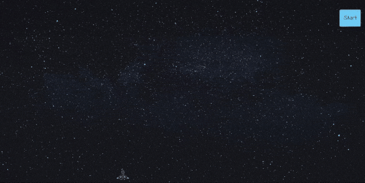

# Asteroid Blaster

## About
The goal of the game is to avoid the asteroids and destroy as many as possible. A good score comprises a high kill count and a long round. The game is over after three lives have been used.

### Major changes
- The player is limited to 3 lives per game
- The player can shoot incoming asteroids
- Number of asteroids destroyed and time elapsed is measured each round
- The player sees results at the end of the game

### Minor changes
- The gameboard is now full screen
- The player is a spaceship instead of a cheeseburger
- The cats are now asteroids
- The game starts when a button is pressed

### Controls
- **Arrow-left**: move-left one space
- **Arrow-right**: move-right one space
- **Arrow-up**: shoot

> **Warning**: Resizing the browser during the game can produced some unintended effects. Not mobile friendly either. Best experience can be achieved on a desktop at full-screen.
